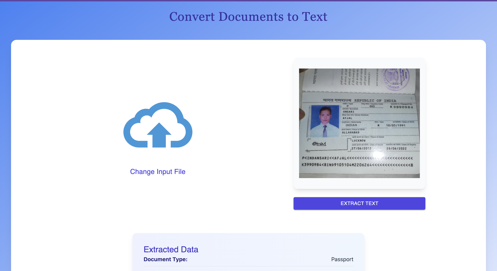
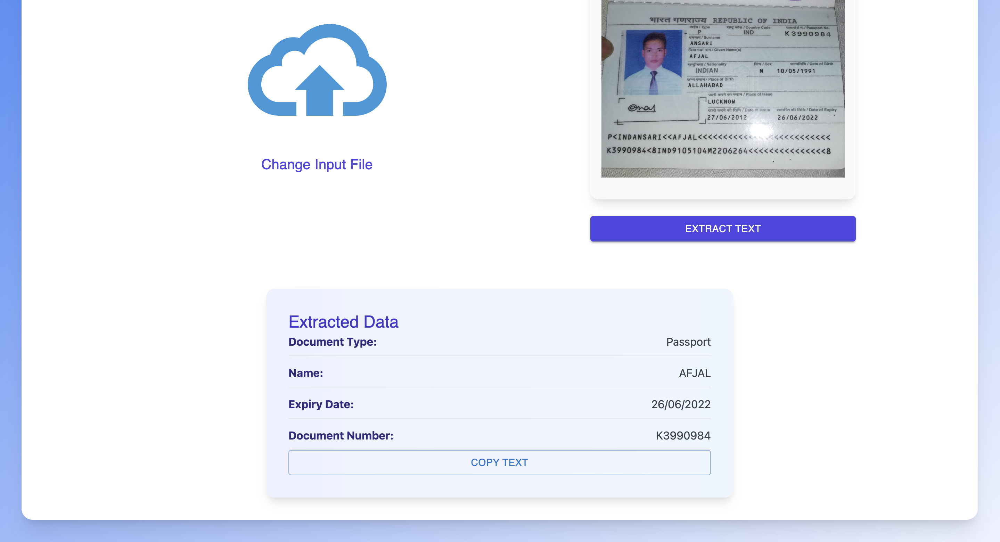

## DOCU-Parser - Document Extraction

### Live Link :[https://docuparser.netlify.app](https://docuparser.netlify.app)

Overview
DocuVille is a document extraction tool designed to capture key information from images of important documents like passports, driver's licenses, and other identification forms. The project utilizes Google Vision API for text extraction and applies regular expressions to parse and extract specific details like the name, document number, and expiration date.

Features

- Text Extraction: Extracts text from document images using Google Vision API.
- Data Parsing: Utilizes regex patterns to identify and extract key information.
- Worldwide Support: Works for various types of documents and languages.

Tech Stack

- Frontend: React.js, Javascript
- Backend: Node.js, Express, JavaScript, Material UI
- APIs & Libraries:
  - Google Vision API for Optical Character Recognition (OCR)
  - Multer for image uploads
  - Regex for data parsing

Project Structure
The project is structured into two main parts:

- Frontend: Located in the frontend folder
- Backend: Located in the backend folder

Sample Screenshots
Below are examples of documents processed using the tool:

Sample 1


Sample 2


Setup & Installation

Prerequisites
Make sure you have the following installed:

- Node.js
- npm
- Google Cloud Project with Vision API enabled

```
   git clone https://github.com/Wasif0787/docu-parser
   cd DocuVille_Intern_Technical_Assessment_Wasif
```

2. Frontend Setup
   Navigate to the frontend folder:

   ```
   cd frontend
   npm install
   npm run build
   ```

3. Backend Setup
   Navigate to the backend folder:
   ```
   cd ../backend
   npm install
   npm run dev
   ```

🔍 How It Works

Step 1: Image Upload

- The frontend allows users to upload document images.
- The uploaded images are sent to the backend.

Step 2: Text Extraction

- The backend uses Google Vision API to extract raw text from the uploaded images.

Step 3: Data Parsing with Regex

- The extracted text is processed using regex patterns to identify and extract fields like:
  - Name
  - Document Number
  - Expiration Date

Environment Variables
Make sure to set up the following environment variables in a .env file in both frontend and backend folders.
Sample env are present in both the frontend and backend folders.

Running the Project

1. Start the frontend server:
   cd frontend
   npm start
2. Start the backend server:
   cd backend
   npm run dev
3. Open your browser and navigate to http://localhost:5173.
